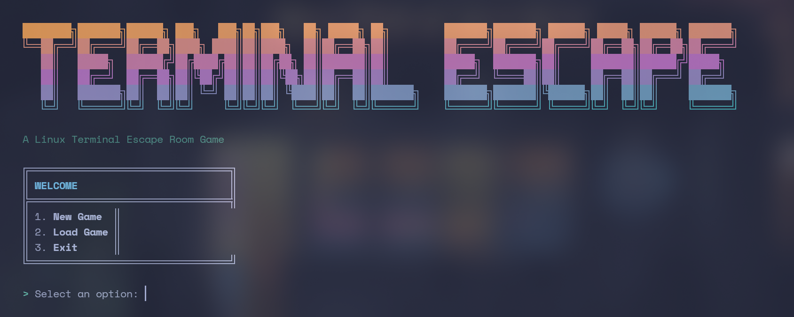

# ShellQuest

ShellQuest is an expandable, hackable and open source interactive text-based escape room game and engine that challenges players to solve puzzles using Linux terminal commands and concepts.

The main aim of ShellQuest is to be expanded by the users that can then share their levels with others.

## Introduction

In ShellQuest, you'll navigate through a series of increasingly difficult levels, each requiring you to use your knowledge of Linux commands and problem-solving skills. Whether you're a Linux expert or a beginner, the game provides an engaging way to learn and practice terminal skills in a fun, gamified environment.

## Features

- Multiple challenging levels with increasing difficulty
- Linux terminal simulation with common commands
- Player profiles and save system
- Achievement system to track your progress
- Helpful hints when you get stuck
- Progress map to visualize your journey
- Leaderboard to compare your performance

## Installation

1. Make sure you have [Bun](https://bun.sh/) installed on your system
2. Clone this repository
3. Run `bun install` to install dependencies
4. Run `bun run dev` to start the game

## Getting Started

1. Start the game with `bun run dev`
2. Create a new profile or load an existing one
3. Follow the in-game instructions to begin your first level
4. Use Linux commands to solve puzzles and progress through levels

## How to Play

- Use Linux commands to interact with the game environment
- Type `/help` at any time to see available commands
- Use `/hint` if you get stuck on a level
- Use `/save` to save your progress
- Use `/menu` to return to the main menu

## Save System

The game automatically saves your progress as you complete levels. Each player has their own profile that stores:
- Current level progress
- Achievements unlocked
- Game statistics

You can have multiple profiles for different players on the same computer.

## Achievements

Unlock achievements by completing specific challenges:
- Completing levels
- Using specific commands
- Finding hidden secrets
- And more!

Check your achievements from the main menu to track your progress.

## Creating New Levels

ShellQuest is designed to be easily expandable with new levels. If you're interested in creating your own levels, check out the [LEVELS.md](LEVELS.md) guide in the repository.

## Troubleshooting

- **Game won't start**: Make sure Bun is installed correctly and you've run `bun install`
- **Can't save progress**: Check that your user has write permissions to the saves directory
- **Commands not working**: Make sure you're using the correct syntax for the level

## Game Structure

The game is organized into several core components:

- **Core System**: Game state management, level system, achievements
- **UI**: Terminal interface, visual effects, menus
- **Levels**: Individual puzzle challenges

## Contributing

Contributions are welcome! Feel free to:

- Create new levels
- Fix bugs
- Improve the UI
- Add new features

Please follow the existing code style and structure when making contributions.

## License

This project is licensed under the MIT License - see the [LICENSE](LICENSE) file for details.

## Acknowledgments

- Inspired by Linux terminal escape rooms and CTF challenges
- Built with TypeScript and Bun
- Special thanks to all contributors
